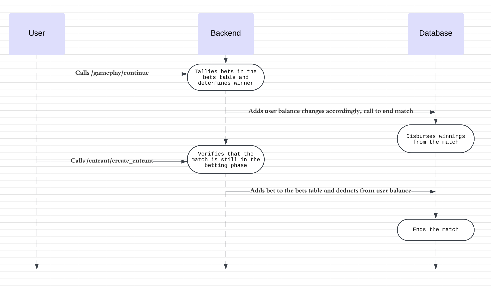
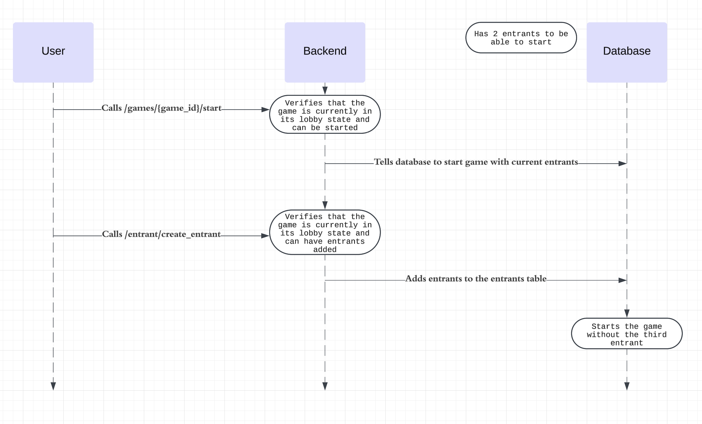
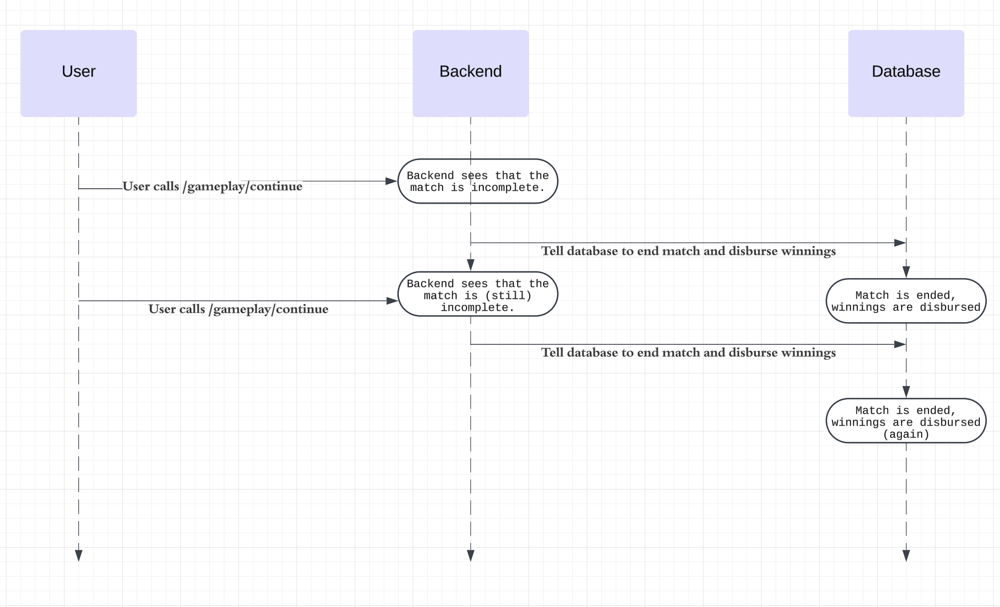

Criteria:
- three cases where your service would encounter phenomenon if it had no concurrency control protection in place
- sequence diagram for each case
- What will you do to ensure isolation of your transactions and why is that the appropriate case
    - https://observablehq.com/@calpoly-pierce/isolation-levels
- Note, this can be both how a particular transaction definition interacts with other transaction definitions, but also how a transaction definition interacts with other concurrent instances of itself.

1. As user places bet, the match ends

    - Match reads data as if the bet was not placed
        - Calculates and disburses winnings as if bet was not placed
    - Bet is still placed and user still loses money
    Inconsistent state: Disbursements are as if the user did not place the bet, but the users balance is as if they did place the bet.
    
       - Planned Solution: Add a read lock to the matches/completed_matches tables when the continue endpoint is run. This would prevent the bet endpoint from verifying that a match is incomplete when it is in the process of being completed.
    

3. A user creates an entrant as the game starts

    - User calls to start the game with the current entrants.
    - Another user makes a call to add an entrant and adds another entrant to the entrants table.
    Inconsistent state: Entrant is added but is not in the game
    
     - Planned Solution: Add a read/write lock to the matches/completed_matches, rounds/completed_rounds, and games/completed_games tables when the continue endpoint is run. This would prevent the create_entrant call from verifying that the game is not started if its in the process of being started.
    

3. The game is continued by two different users at once.

    - First call verifies the condition for a match end 
        - disburses winnings
    - Second call verifies the condition for a match end
        - disburses winnings again
    - Inconsistent state: match is ended twice, winner is calculated twice, insert into winners twice, insert into losers twice.
        - Technically possible for both entrants to win and lose at the same time. which is a problem
        
    - Planned Solution: Add a read/write lock to the matches/completed_matches, rounds/completed_rounds, and games/completed_games tables when the continue endpoint is run. This would prevent other continue calls from reading the same state as a concurrent continue call.
        

